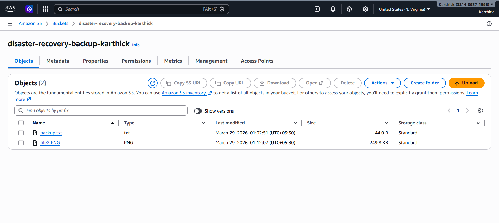
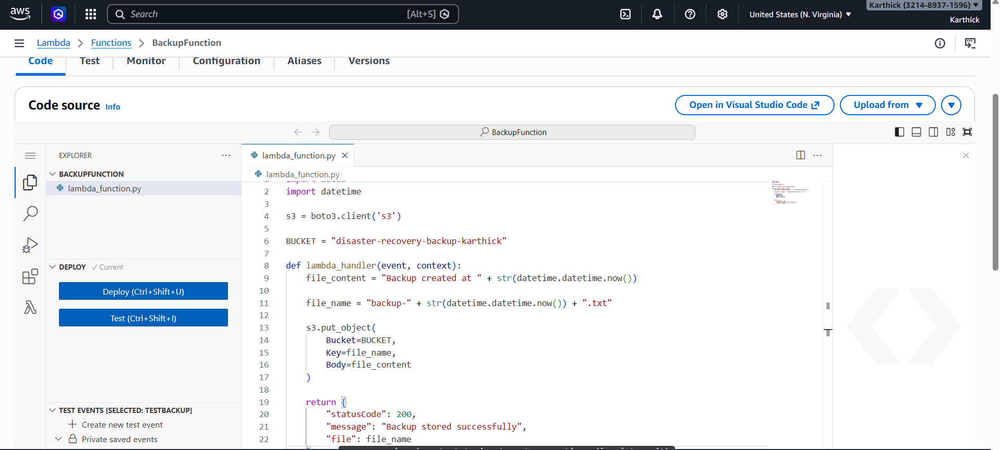
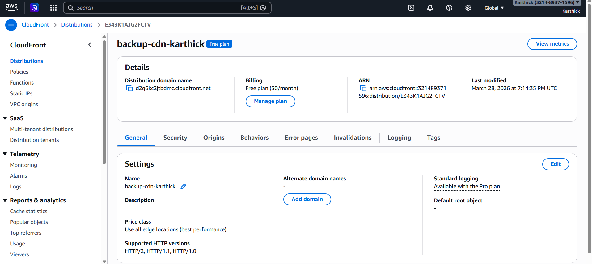

# 🚀 Disaster Recovery & Backup System

## 📌 Overview
This project demonstrates a secure disaster recovery system using AWS services with global content delivery and HTTPS access.

## 🏗️ Architecture
User → CloudFront → S3 (Private) → Lambda

## ⚙️ Technologies Used
- AWS Lambda
- Amazon S3 (Private Bucket with Versioning)
- Amazon CloudFront (CDN with HTTPS)
- GitHub (Version Control)

## 🔥 Features
- Automated backup creation using Lambda
- Secure file storage in private S3 bucket
- Global file access via CloudFront CDN
- HTTPS enabled secure delivery
- High availability and scalable design

## 🌍 Live Demo
https://d2q6kc2jtbdmc.cloudfront.net/file2.PNG

## 📸 Screenshots

### CloudFront Output

### S3 Bucket

### Lambda Function

### CloudFront Distribution

## 📁 Project Structure
